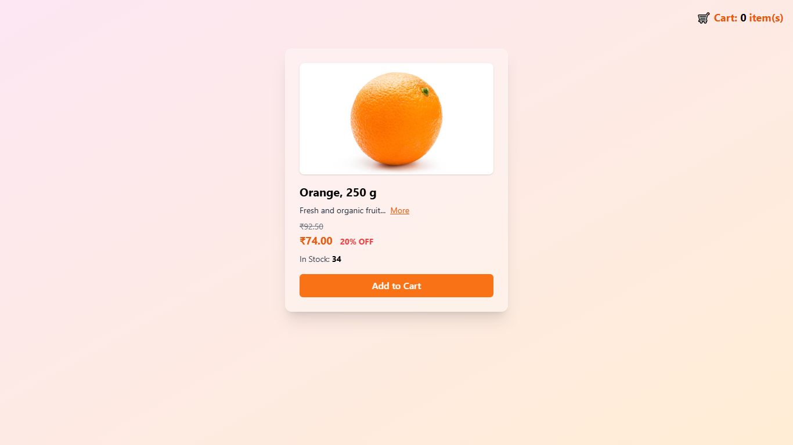

# 🌱 E-commerce Product Card (Practise)

A modern, interactive product card built with **HTML**, **Tailwind CSS** (inline), and **JavaScript**. This demo features:

- **Glassmorphism UI** with bubbling animation  
- **Strawberry color themes**  
- **Dynamic pricing** including discounts  
- **Real-time inventory tracking**  
- **Smart cart controls** (Add, +, –)  
- **Notifications (toasts)** for cart interactions  
- Fully responsive, lightweight, and easy to integrate  

---

## 🛠️ Demo & Features

1. **Cart Counter** at the top of the page updates on adding/removing products.  
2. **"Add to Cart" button** transforms into a `- [count] +` control once clicked.  
3. **Inventory** decreases/increases in real time based on your actions.  
4. **Popup toasts** appear at the bottom-right on each cart action for instant feedback.  
5. **Discount Calculator** dynamically computes and displays discounted prices.

---

## 📸 Preview




## 🎯 Getting Started

1. **Clone the repository**  
   ```bash
   git clone https://github.com/Sai4u-dev/practise.git
   cd practise
